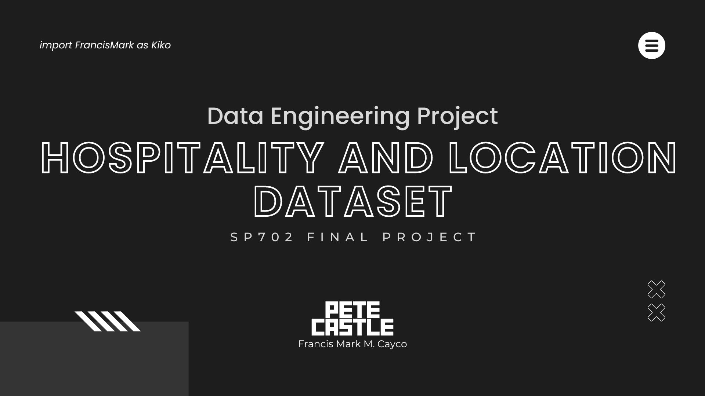

# Hospitality and Location Dataset
*SP702 - Python for Data Engineering (Final Project)*
Project SPARTA - Development Academy of the Philippines

**TO MY FELLOW SPARTA CLASSMATES:**
- All CSV files are saved under **final_data** folder.
- Running the python scripts will take a while depending on the amount of data input.  
- For task 5, Google Chrome will appear as you run the script.  Do not close the browser until the script is finished.
- If you need assistance in running the script, feel free to DM me.

This ETL project extracts and transforms hospitality and location data from various sources. 

## Data Sources
1. TripAdvisor (https://www.tripadvisor.com.ph)
2. RapidAPI's TripAdvisor Endpoint (https://rapidapi.com/apidojo/api/travel-advisor)
3. Philippine Statistics Authority OpenStat (https://openstat.psa.gov.ph/)
4. Humanitarian Data Exchange by United Nations Population Fund (https://data.humdata.org/)

## For Tasks 1-4
*Hotel, Tourist Sites, and Hotel Data*
This extensive dataset covers aspects of the hospitality industry, in the Philippines. It consists of reviews from hotels over the country giving feedback on accommodations. Moreover, it includes reviews of tourist sites providing insights into visitor experiences well as restaurant reviews that offer a glimpse into dining experiences. With information such as entity names, ratings, review content and visit dates this dataset presents a view of customer sentiments and preferences within the vibrant hospitality landscape of the Philippines. Whether it’s about accommodations, attractions, or dining options this data enables an analysis of customer satisfaction and trends, in this Southeast Asian destination.

### How did I extract the data?
1. The GeoID of the location is obatined using the **RapidAPI's TripAdvisor Endpoint**. The GeoID is used to get the data from the TripAdvisor website.
2. The GeoID is referenced in the TripAdvisor website, returning the URLs of hotel, restaurants, and attractions in the location.
3. The list of hotels and detail of each hotel is obtained from the TripAdvisor website.
4. **BeautifulSoup** library to is used to extract the data hotel page.

## For Task 5
*Location Data*
This dataset provides a collection of information that reflects the landscape of the Philippines. It includes data, on geography, language, economy, and society. From details like barangays, municipalities, provinces and regions to information and literacy rates this dataset captures the cultural and social fabric of the country. Moreover, it explores aspects by including indicators such, as Gross Regional Domestic Product (GRDP) Consumer Price Index (CPI) and transportation statistics. This combination of data does not allow for an understanding of the Philippines but also facilitates informed analysis of language distribution, economic trends, literacy levels and transportation networks. Overall, it offers a depiction of the dynamics shaping the nation.

The data is obtained from the **Philippine Statistics Authority OpenStat** website.  There are multiple datasets that can be downloaded from the website.  I only selected the datasets that are aggregated into any geographical level (i.e. region, province, municipality, barangay).  Selected files are transformed and joined.

